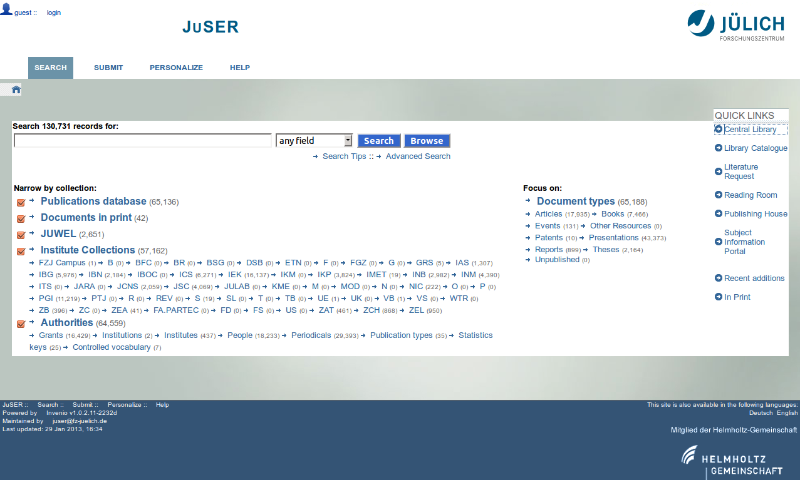
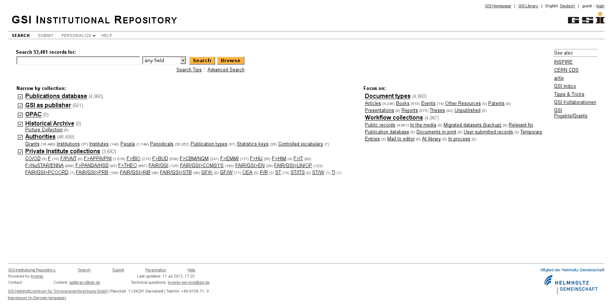
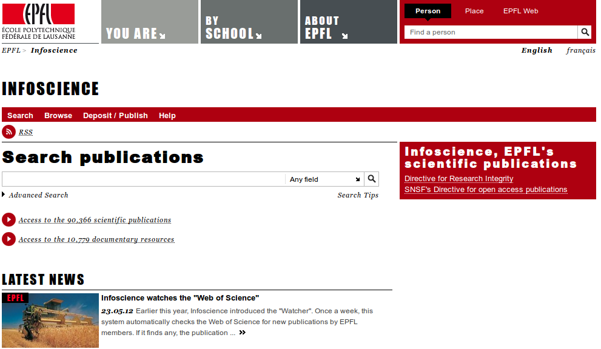
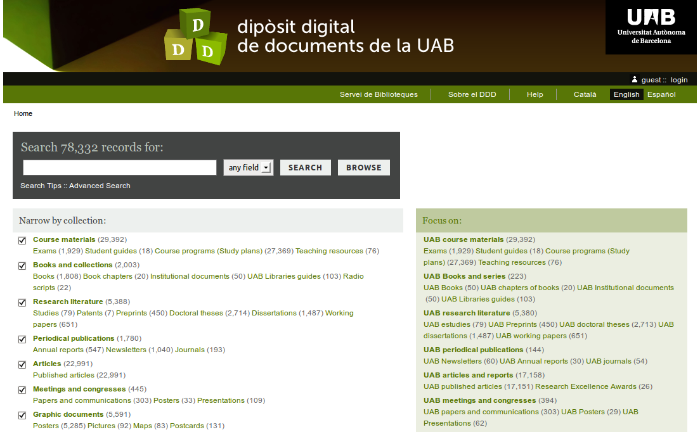

**********************
Demo and Example Sites
**********************

There are several Invenio installations that you can have a look at in
order to see it in action:

Demo Sites
==========

`Atlantis Institute of Fictive Science <http://invenio-demo.cern.ch/>`_
    *running Invenio 1.1.2, released 2013-08-19*

    Atlantis Institute of Fictive Science is an official demo site of
    Invenio.  It demonstrates a basic setup of Invenio. You could
    (should) obtain this site if you install Invenio for the first
    time, by lauching `inveniocfg --create-demo-site` and
    `inveniocfg --load-demo-records`. This is useful to verify the
    functionality of your installation prior to customizing the system
    for production.

`Atlantis Institute of Fictive Science Next <http://invenio-demo-next.cern.ch/>`_
    *running Invenio next branch*

    Atlantis Institute of Fictive Science is an official demo site of
    Invenio.  It demonstrates a basic setup of Invenio. You could
    (should) obtain this site if you install Invenio next branch for the first
    time, by lauching `inveniocfg --create-demo-site` and
    `inveniocfg --load-demo-records`. This is useful to verify the
    functionality of your installation prior to customizing the system
    for production. (The next branch is based on new technologies such as
    `Werkzeug <http://werkzeug.pocoo.org/>`_, `Flask <http://flask.pocoo.org/>`_,
    `Jinja2 <http://jinja.pocoo.org/>`_,
    `Twitter Bootstrap <http://twitter.github.com/bootstrap/>`_ and
    `SQLAlchemy <http://www.sqlalchemy.org/>`_).

Production Sites
================

.. image:: _static/CDS20120611.png
   :width: 200 px
   :align: right

`CERN Document Server <http://cds.cern.ch>`_
   *CERN, Geneva, Switzerland*

   At CERN, Invenio manages over 800,000 bibliographic records and
   350,000 fulltext documents, organized in more than 500
   collections, covering preprints, articles, books, journals,
   photographs, videos and more, of interest to people working in
   particle physics. You can check out this site if you want to see
   the performance and scalability of Invenio.

.. image:: _static/Inspire20120611.png
   :width: 200 px
   :align: right

`INSPIRE <http://inspirebeta.net>`_
   *CERN, Geneva, Switzerland*

   INSPIRE is the high-energy physics information system that combines the
   successful `SPIRES <http://www.slac.stanford.edu/spires>`_ database
   content, curated at `DESY <http://www.desy.de/>`_, `Fermilab
   <http://www.fnal.gov/>`_ and `SLAC <http://www.slac.stanford.edu/>`_
   for decades, with the Invenio digital library technology developed at
   `CERN <http://www.cern.ch/>`_. INSPIRE is run by a collaboration of the
   four labs and interacts closely with high-energy physics publishers,
   `arXiv.org <http://arxiv.org/>`_, `NASA-ADS <http://adswww.harvard.edu/>`_,
   `PDG <http://pdg.lbl.gov/>`_, and other information resources.

.. image:: _static/Labordoc201206011.png
   :width: 200 px
   :align: right

`Labordoc <http://labordoc.ilo.org>`_
   *ILO, Geneva, Switzerland*

   Labordoc is your access to literature on the world of work. Produced
   and maintained by a network of 28 ILO libraries around the world,
   Labordoc covers all aspects of work and sustainable livelihoods and the
   work-related aspects of economic and social development, human rights
   and technological change. Labordoc includes all publications by the
   ILO, whether published in electronic or print format, Geneva or in the
   field, since 1919 and in all languages.

`JuSER <http://juser.fz-juelich.de>`_
   *Forschungszentrum Jülich, Germany *

   Jülich Shared Electronic Resources (JuSER)  lists scientific
   publications by employees of Forschungszentrum Jülich and provides open
   access to a many of these publications. Forschungszentrum Jülich is one
   of Europe's largest interdisciplinary research centres, with special
   expertise in physics, materials science, nanotechnology, and
   information technology. The JuSER publications portal is organized into
   a publications database, open- access documents and institute
   collections.

`GSI Institutional Repository <http://repository.gsi.de>`_
    *GSI Helmholtzzentrum für Schwerionenforschung GmbH, Germany*

     The GSI Institutional Repository is the portal to the references of the
     scientific publications and to the open access full texts of the GSI
     scientists. GSI operates a unique large-scale accelerator for heavy ions.
     Researchers from around the world use this facility for experiments.

`RERO DOC <http://doc.rero.ch/>`_
    *RERO, Martigny, Switzerland*

    Digital library of RERO, the Library Network of Western
    Switzerland. Created to promote, preserve and provide public
    access to the grey literature (e-theses, dissertations, e-prints)
    of institutions participating in the project, as well as to the
    digitalized collections of RERO libraries. Serves both as an OAI
    data provider and OAI data harvester. Open for subscription to
    non-RERO members.

`EPFL Infoscience <http://infoscience.epfl.ch/>`_
    *EPFL, Lausanne, Switzerland*

    The scientific information portal of the École Polytechnique
    Fédérale de Lausanne (EPFL). The repository's goal is twofold:
    (i) to provide a common catalog for the fifty libraries of EPFL;
    (ii) to be the institutional memory of the scientific
    production, in terms of research publications and reports,
    teaching material, and student projects.

`CAB UNIME <http://cab.unime.it/CDSware09/>`_
    *University of Messina, Italy*

    Search portal of the Centro di Ateneo per le Biblioteche (CAB) of
    the University of Messina. Containing more than 200,000 records.

`Aristotle University of Thessaloniki <http://digital.lib.auth.gr/>`_
    *Aristotle University, Thessaloniki, Greece*

    A.U.Th Library and Information Center have introduced 'Psifiothiki' in
    2003 and since then holds more than 125,000 records, offering access
    to rare library books and collections, archival material, grey
    literature and institutional publications.  For detailed information on
    the hosted collections, please see `http://www.lib.auth.gr/index.php/en/digitalization <http://www.lib.auth.gr/index.php/en/digitalization>`_.

`HBZ Digitalisierte Drucke Portal <http://www.digitalisiertedrucke.de/>`_
    *HBZ NRW, Cologne, Germany*

    "Central Index of Digitized Imprints" (zvdd) provides the basis
    for a national portal providing a general index of all scholarly
    relevant digitized resources dating from the beginning of printing
    to the 21st century.

`SYSDOC <http://sysdoc.com.dtu.dk/>`_
    *Systems Competence Area, Research Center COM, Technical University of Denmark*

    SYSDOC is the institutional repository of the Systems Competence
    Area at COM*DTU, and primarily covers the area of optical fibre
    communication systems, which is the core competence of the
    group. Published articles, Ph.D. and M.Sc. Theses, teaching
    material and project reports are available in fulltext.

`Dipòsit Digital de Documents (DDD) <http://ddd.uab.cat/>`_`::
    *Universitat Autònoma de Barcelona, Spain*

    Dipòsit Digital de Documents (DDD) is the project to handle all
    digital content at UAB libraries in a single platform, so it can
    be found with a single search, but structured in smaller
    collections.  Growth is constant, but basically we have five types
    of collections: UAB digital publications, bibliographic databases,
    personal archives, course materials, and digitised material,
    either in-house or commercial.

`RomDoc <http://romdoc.upb.ro/>`_
    *UPB-CTTPI, Bucharest, Romania*

    Part of RomDoc Project, funded by Swiss National Science
    Foundation, in the frame of the international cooperation
    programme SCOPES 2005-2008 (Scientific Co-operation between
    Eastern Europe and Switzerland).  Project partners are
    ETH-Bibliothek from ETH Zurich (Eidgenössische Technische
    Hochschule Zürich - Swiss Federal Institute of Technology Zurich)
    and CTTPI (Center for Technology Transfer in the Process
    Industries at University POLITEHNICA of Bucharest) , in close
    collaboration with the Central University Library of UPB.  The aim
    of the project is to implement a publication platform for
    scientists in Romania for recording and long-term storage of
    selected digital born and scanned scientific material.
    Publications from the scientists of Romanian Universities not
    published within the traditional publishing industry will be
    stored centrally on a dedicated server at University “Politehnica”
    of Bucharest (UPB).  The electronic documents will be indexed by
    librarians according to international standards and made available
    worldwide through a central user interface.

`University of Applied Sciences of Fribourg <http://multidoc.hefr.ch/>`_
    *EIA-FR, Switzerland*

    HES-SO Fribourg Document Server is the integrated digital library
    server at the University of Applied Science of Western
    Switzerland, which aim to build a rich common repository for
    managing and archiving the whole scientific data. It provides a
    complete system for uploading, reviewing, and publishing, browsing
    and retrieving all articles, research publications, reports, and
    student projects.

`ILC Document Server <http://ilcdoc.linearcollider.org/>`_
    *International Linear Collider*

    The document server of the International Linear Collider. Planning
    and designing the proposed electron-positron collider will require
    global participation and global organization.  ILCDoc serves as a
    central repository for project documents and information shared
    among the hundreds of collaborators, scientists and engineers, at
    university and laboratories around the world.

`Kulturarchiv Oberengadin <http://search.kulturarchiv.ch/>`_
    *Upper Engadine Cultural Archives, Switzerland*

`Repozytorium Eny Politechnika Wrocławska http://zet10.ipee.pwr.wroc.pl/>`::
    *Wroclaw University of Technology, Poland*

    Institutional Repository of the Dept. of Electrical Engineering,
    Wroclaw University of Technology.

`Repositorio Digital de la Universidad de Zaragoza (ZAGUAN) <http://zaguan.unizar.es/>`_
    *University of Zaragoza, Spain*

    Repositorio Digital de la Universidad de Zaragoza (ZAGUAN) is a
    project aimed to handle all digital content at UZ in a single
    platform, so it can be found with a single search, but structured
    in smaller collections. The initial project, started in 2008,
    includes a collection of digital copies of rare books and
    manuscripts. Further developments: doctoral dissertations,
    e-books, pre-prints, articles, proceedings ...

`Schweizerischer Dokumentenserver Bildung <http://edudoc.ch/>`_
    *Bern, Switzerland*

    The "Swiss Document Server in Education" aims at collecting and
    providing electronic documents in the fields of education policy,
    educational administration, educational planning and educational
    research and development in Switzerland.

`Pacific Rim Library <http://prl.lib.hku.hk/>`_
    *Hong Kong*

    Twenty-five academic libraries surrounding the Pacific are
    cooperating with each other to leverage the use of their digital
    resources. Metadata from member library local collections has been
    harvested and archived here to increase discovery and access, and
    to allow one search across all data.

`OpenAIRE Orphan Record Repository <http://openaire.cern.ch/>`_
    *CERN, Geneva, Switzerland*

    Recent deployment of Invenio to serve the OpenAIRE Orphan Record
    Repository. `OpenAIRE <http://www.openaire.eu/>`_ aims to support
    the implementation of Open Access in Europe. It provides the
    means to promote  and realize the widespread adoption of the
    Open Access Policy, as set out by the ERC Scientific Council
    Guidelines for Open Access and the Open Access pilot launched
    by the European Commission.

`National Repository of Grey Literature <http://invenio.ntkcz.cz/>`_
    *National Technical Library, Czech Republic*

`Invenio at TRIUMF <http://invenio.triumf.ca/>`_
    *TRIUMF, Canada*

`SUDigital <http://lib.sudigital.org/>`_
    *Sofia University, Bulgaria*

    Digital library in the field of humanitarian studies at University of Sophia.

`Kumasi Polytechnic Library <http://library.kpoly.edu.gh/>`_
    *Kumasi Polytechnic, Ghana*

    Library catalog of the Kumasi Polytechnic.

`EELA Document Server <http://documents.eu-eela.org/>`_
    *CIEMAT, Spain*

`Documents Consorzio Cometa <http://documents.consorzio-cometa.it/>`_
    *INFN, Italy*

.. image:: _static/Himaldoc20120608.png
   :width: 200 px
   :align: right

`Himalayan Document Centre (HIMALDOC) <http://www.icimod.org/himaldoc/>`_
    *ICIMOD, Kathmandu, Nepal*

    The Himalayan Document Centre (HIMALDOC) of the `International Centre for Integrated Mountain Development (ICIMOD) <http://www.icimod.org/>`_ aims to
    provide resources focused on sustainable mountain development (SMD)
    issues in various electronic formats. The resources are of several
    types, and include books, articles, periodicals, theses, multimedia
    products, and other reference materials include ICIMOD publications.

.. image:: _static/Solano20120611.png
   :width: 200 px
   :align: right

`SolanoHistory.org <http://www.solanohistory.org/>`_
    *Vacaville Heritage Council, Solano County, CA, USA*

    SolanoHistory.org is an online, interactive database containing
    historical articles, photos, books, and other content relating to the
    history of Solano County, CA. The Vacaville Heritage Council is a
    non-profit historical archives and research organization specializing
    in local Solano County History.

`GISELA Documents Server <http://documents.gisela-grid.eu/>`_
    *CETA-CIEMAT, Spain*

    GISELA Documents Server provides, by categories, all public documents
    produced by GISELA Project (see http://www.gisela-grid.eu).

.. image:: _static/Traces20120611.png
   :width: 200 px
   :align: right

`TRACES Base de dades de llengua i literatura catalanes <http://traces.uab.cat/>`_
    *TRACES, Spain*

    TRACES: the bibliographical data base on Catalan language and
    literature. TRACES project born on 1987 by the Grup d'Estudis de
    Literatura Catalana Contemporània (GELCC) from the Universitat
    Autònoma de Barcelona.

.. image:: _static/IDEP201208022.png
   :width: 200 px
   :align: right

`IDEP Document Server <http://www.unidep.org/library/>`_
    *IDEP, Senegal*

    Document server of the African Institute for Economic Development and
    Planning.

`DESY Pubdb <http://bib-pubdb1.desy.de/>`_
    *Deutsches Elektronen-Synchrotron DESY, Germany*

    The DESY Publication database (Pubdb) contains references for
    scientific publications as well as open access to many of the
    corresponding full texts. DESY is one of the world’s leading
    accelerator centres. Researchers from around the world use the
    large-scale facilities at DESY to explore the microcosm in all its
    variety – from the interactions of tiny elementary particles and the
    behaviour of new types of nanomaterials to biomolecular processes that
    are essential to life.

If you want to list your Invenio instance on this page, please
let us know at `info@invenio-software.org`.
